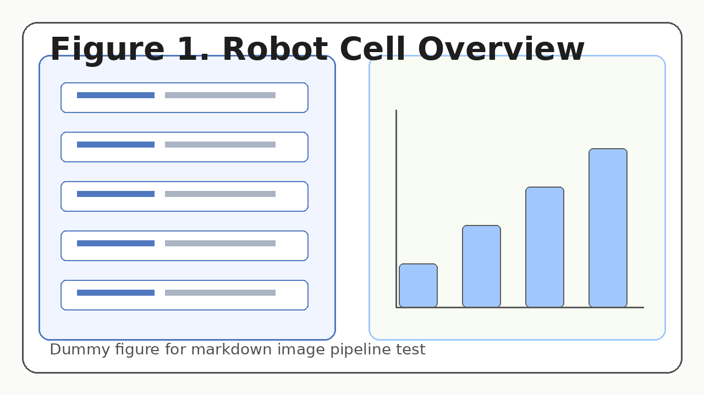
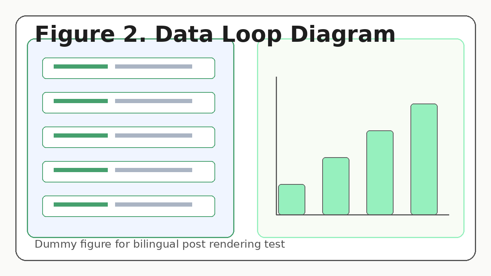

## 이 글의 목적

이 문서는 **초기 사이트 개발 및 퍼블리시 파이프라인 테스트**를 위한 더미 포스팅입니다.

다음 항목을 함께 점검하기 위해 작성되었습니다.

- 한국어/영어 페이지 쌍 렌더링
- 썸네일(cover.webp) 노출
- 본문 이미지 렌더링
- 태그/요약/메타데이터 표시
- 홈 최신 글 카드 반영

## 핵심 메모 (더미 내용)

Physical AI 제조 시스템을 설계할 때는 모델 성능만이 아니라 다음의 루프를 함께 고려해야 합니다.

1. **작업 정의**: 공정 단계와 성공 조건 정의
2. **데이터 수집**: 비전/힘/상태 로그 확보
3. **정책 개선**: 모델/규칙 기반 제어 개선
4. **현장 검증**: 안전성과 반복성 확인
5. **운영 피드백**: 오류 유형과 재학습 포인트 축적

위 이미지는 본문 이미지 렌더링과 캡션/alt 테스트를 위한 예시입니다.

## 데이터 루프 관점의 중요성 (더미)

초기 실증 단계에서는 화려한 모델보다도 **관측-기록-개선 루프의 품질**이 성과를 좌우하는 경우가 많습니다.  
특히 제조 공정에서는 실패 유형 분류와 원인 추적을 위한 로그 구조화가 중요합니다.

## 향후 자동화 대상 (더미)

향후에는 Claude Code가 아래를 자동화하도록 확장할 수 있습니다.

- 원문(한국어) 기반 영문 번역 생성
- 태그 추천 및 요약문 생성
- cover 이미지 자동 생성
- arXiv 링크 기반 요약 포스팅 생성 (What I read)

---

> 본 문서는 사이트 기능 점검용 더미 포스트입니다.
